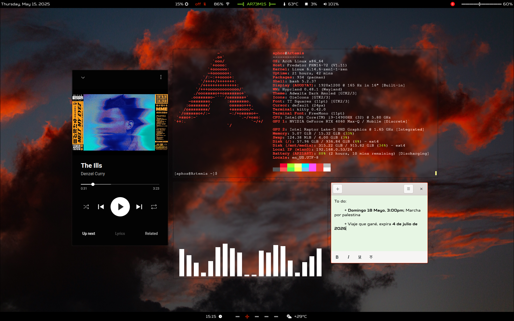
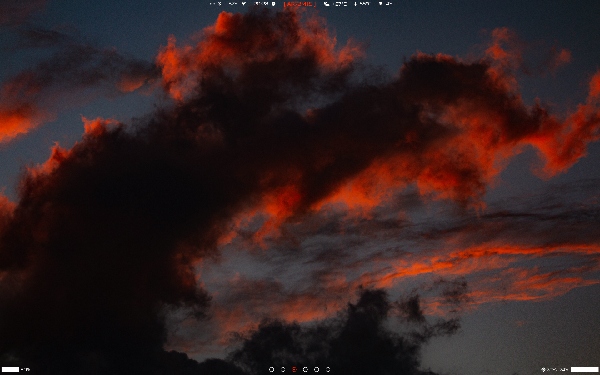

# AR73M1S dots 

Computers have the capacity for love.

# Screenshots

 



## Dependencies 

+ Adwaita Dark Amoled Master theme
+ OieIcons
+ Iosevka Nerd Font (and all other nerd fonts)
+ mako
+ hyprpaper
+ hyprlock
+ hypridle
+ yazi
+ waybar
+ whatsie
+ btop
+ bluez
+ bluez-utils
+ bluetui
+ pulsemixer
+ obsidian
+ sticky-notes
+ GTK settings

## Post install tweaks

Create the directory ```/etc/systemd/sleep.conf.d/``` and add the file ```mem-deep.conf``` with this inside: 

```bash
[Sleep]
MemorySleepMode=deep
```
This will stop battery draining while laptop lid is closed
